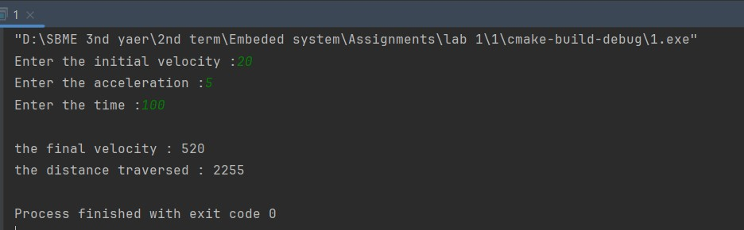
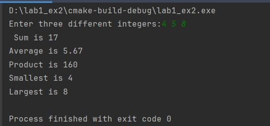
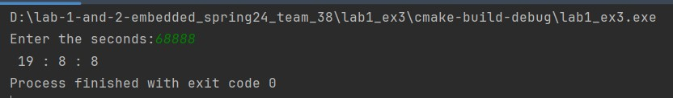
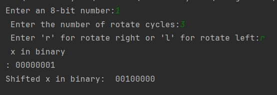
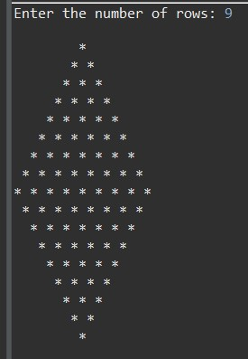
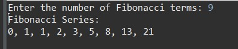
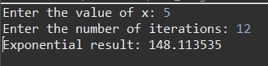

# Team 38 Lab_1 & Lab_2 submition

## Team members
Omar Abdelnasser Shabaan ...... sec:1

Mahmoud Mohamed Ali ...... sec:2

## Output screenshots:

### (1) lab 1 ex1 

### (2) lab 1 ex2

### (3) lab 1 ex3 

### (4) lab 2 ex1 

### (5) lab 2 ex2 

### (6) lab 2 ex3 

### (7) HW_assignment1

## Plus code folder have a solution with other ways